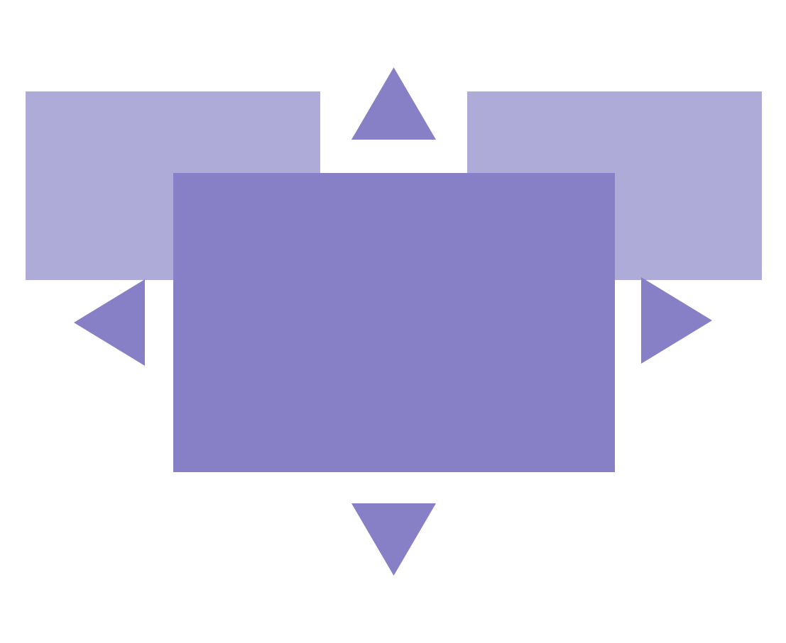
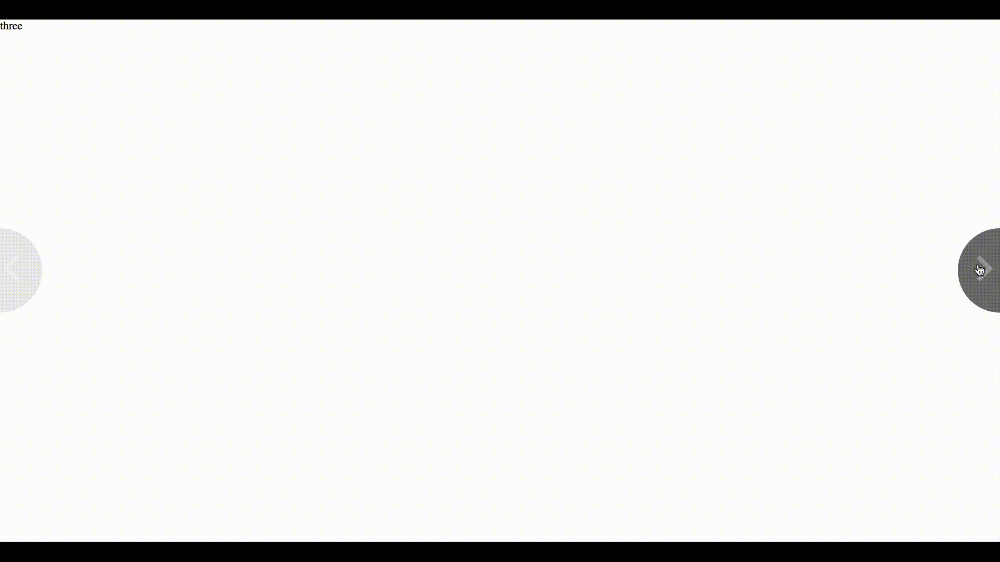

# SectionManager (ALPHA)




Section manager is a free open tool for manage the dom like a magazine or a book it's easy to use and implement.


# instructions

to use SectionManager in our app you need to import the files SectionManager.min.js and SectionManager.min.css from <strong>dist</strong> folder into your webapp.

```html
    <!-- Inside head tag -->
    <link rel="stylesheet" href="./sectionManager.min.css">

    <!-- Put it on the end of the body tag -->
    <script src="./sectionManager.min.js" type="text/javascript"></script>

```

then you have to create two principal content divs in the page.

```html
  <div class="main-container">
    <div class="sub-container">
        
        Some <articles> here...
    
    </div>
  </div>
```

for create the pages of our magazine or book we have to create one div with the following classes

| Class        | Description           |
| ------------- |:-------------:| 
| <strong>main-container</strong> | first container for add custom things like different controlls or info | 
| <strong>sub-container</strong> | contains all the articles to scroll |

# Sample Code

```html

<div class="main-container">
    <div class="sub-container">
        
        <article>
            one
        </article>
    
        <article>
            two
        </article>

        <article>
            three
        </article>

    </div>
</div>
```




# Gulp and new Code

in order to generate the files(sectionManager.min.js and sectionManager.min.css) you need to follow this commands 

``` 
sudo npm install
```

install all the dependencies from package.json and then use this one.

```
gulp
```

# Support table

Coming soon...